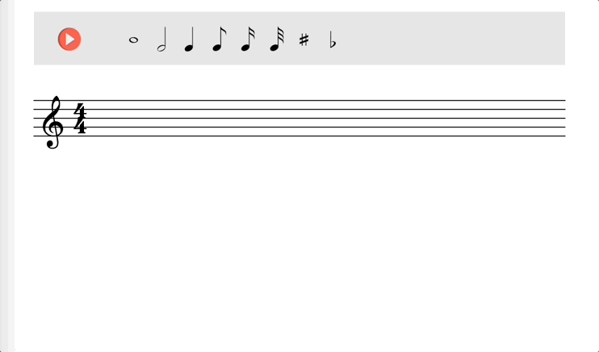

# p5-sheet-music

Most sheet music editors are fairly complicated and targeted at experienced music composers. This minimalistic p5.js editor/player is designed to quickly sketch ideas and/or practice with music notation exercises. This is an ongoing project. There are a lot of features to be implemented to make it as useful as I want it to be.

- [Demo](https://lucasnfe.github.io/p5-sheet-music/index.html) of the current version.

### TODO

- Connect 8th, 16th, and 32nd notes with beam.
- Create chord when a note is placed on top of another note.
- Edit clef, time signature, and notes on the staff.
- ~~Display measures in custom locations~~.
- Display measure number.
- Display and edit tempo (bpm).
- Highligh a note when it is played.
- Add/Remove staff.
- Join two staffs to make a grand staff. 
- Read constants from a json config file.
- Record notes from MIDI controller.
- Print to pdf.
