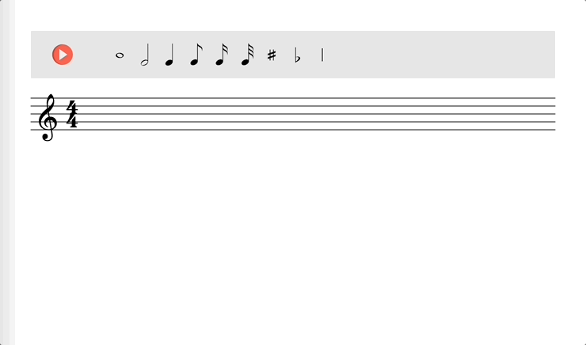

# p5-sheet-music

Most sheet music editors are fairly complicated and targeted to experienced music composers.
This minimalistic p5.js editor/player is designed for quickly skething ideas and/or practicing
with music notation exercices. This is an ongoing project. There is a lot of features to be 
implemented to make it as ufeul as I want it to be.

- [Demo](https://lucasnfe.github.io/p5-sheet-music/index.html) of the current version.

### TODO

- Connect 8th, 16th, and 32nd notes with beam.
- Edit clef, time signature, and notes on the staff.
- Display measures in custom locations.
- Display measure number.
- Display and edit tempo (bpm).
- Highligh a note when it is played.
- Add/Remove staff.
- Join two staffs to make a grand staff. 
- Read constants from a json config file.
- Record notes from MIDI controller.
- Print to pdf.
